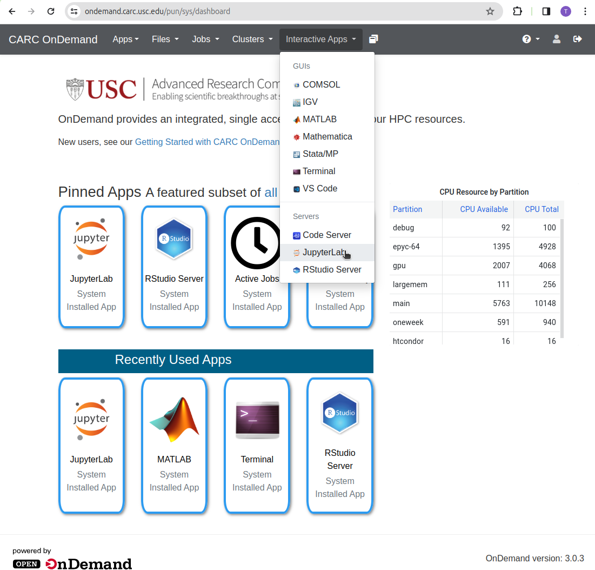
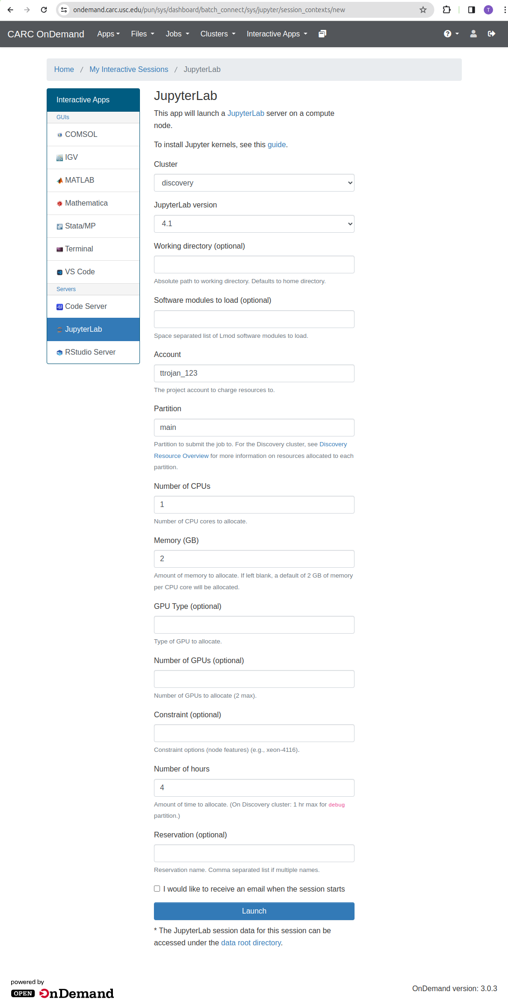
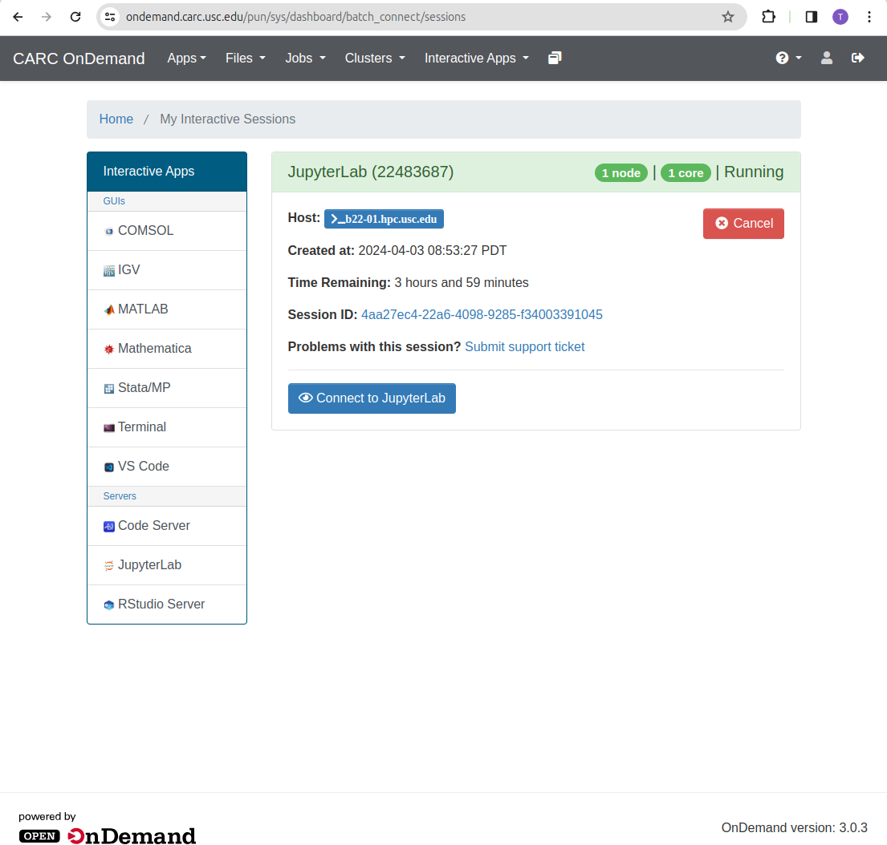
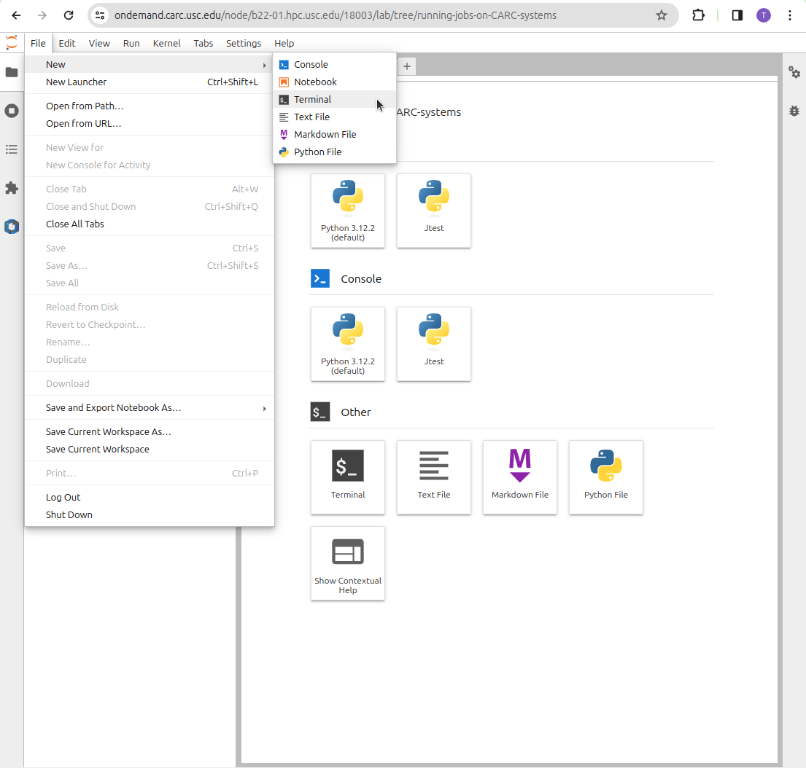

[](https://carc.usc.edu)
# Running jobs on CARC Systems - Workshop

This repository contains preconfigured slurm job script examples, to run on USC CARC Discovery Cluster. 

## By participating in this workshop, you’ll:

* Learn the fundamental skills and tools required to run jobs on CARC Cluster

* Gain experience with different job types and submission file structure

* Take a brief look into troubleshooting your jobs

* Build confidence to create your own jobs

#### Duration: 1.5 hours
#### Prerequisites: An understanding of fundamental CARC Cluster setup and CARC Ondemand.
#### Suggested materials to satisfy prerequisites:
* [Gettting started with Discovery](https://www.carc.usc.edu/user-information/user-guides/hpc-basics/getting-started-discovery)

* [CARC Ondemand](https://www.carc.usc.edu/user-information/user-guides/hpc-basics/getting-started-ondemand)


#### Hardware Requirements: Desktop or laptop computer capable of running the latest version of Chrome or Firefox. 

#### Language: English

## Getting Started
To get started, use a web browser and log on to USC OnDemand Instance at [https://ondemand.carc.usc.edu](https://ondemand.carc.usc.edu) . You need to be on USC Network and need to your USC credentials to log in. More details on how to logon to USC Open OnDemand can be found at [our guide](https://www.carc.usc.edu/user-information/user-guides/hpc-basics/getting-started-ondemand)

To start a Jupyter notebook server, Click on Interactive Apps and then select JupyterLab.



When launching the Jupyter Lab, it is important to select the following
* For Cluster, specify Discovery
* For Account, specify the account you normally use, like `ttrojan_123`
* For Partition, specify main
* Set the number of CPUs to 1
* Set Memory to 2GB
* Set the number of hours to 4

For the regular CARC workshop, please do the above with the following change:
* For Account, specify `hpcsuppt_613`


The above settings are important to ensure you start a JupyterLab Server on a node that is located on the Discovery cluster and has slurm management engine installed and configured



Once your JupyterLab Session starts, Click Connect to JupyterLab button



From there, Click on File -> New and then click on Terminal to get the terminal



Once in the terminal, clone this GitHub Repository

```
module load usc git
git clone https://github.com/uschpc/running-jobs-on-CARC-systems.git
```

In Jupyter, navigate to the example you are interested in, and step through the notebook. 

For first-time users, we highly recommend to do the notebooks in order, as they build up on concepts in the previous notebooks.

