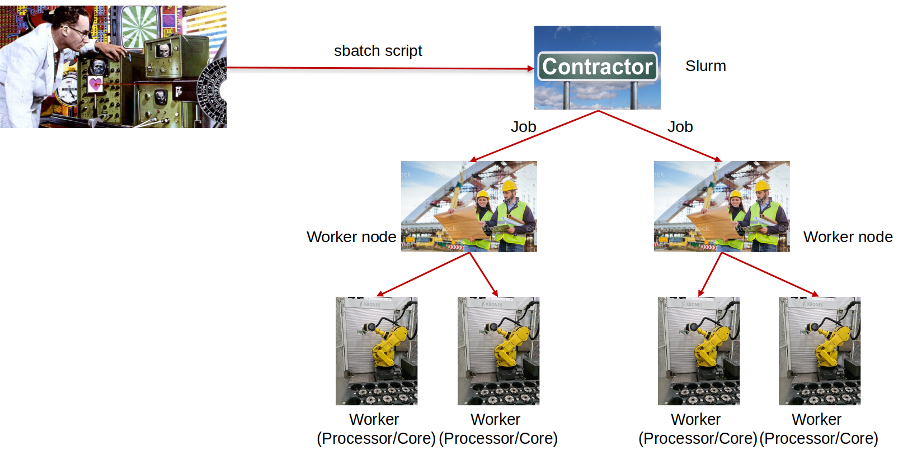
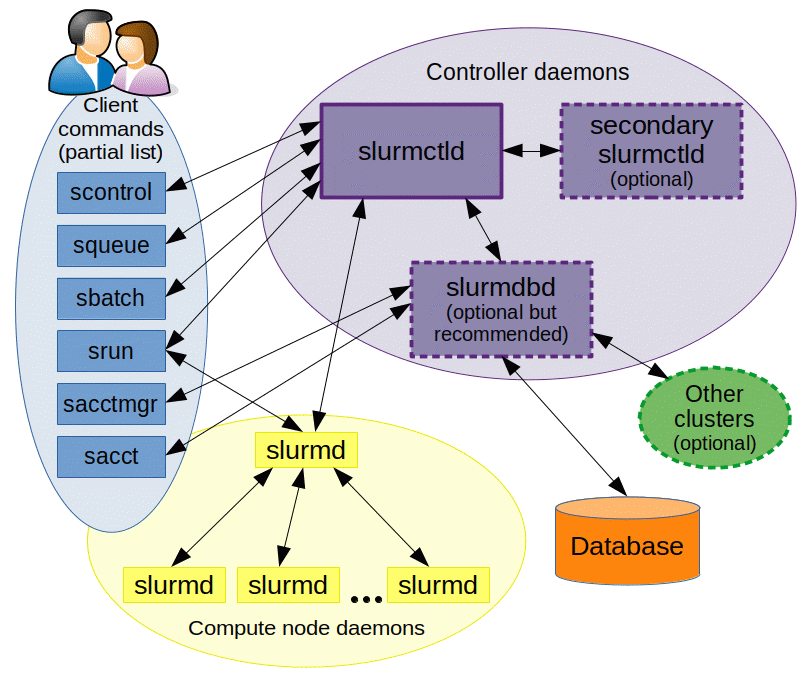

# SLURM

-   Simple Linux Utility for Resource Management [SLURM website](https://slurm.schedmd.com/)
-   Development started in 2002 at Lawrence Livermore National Laboratory
-   Overview:
    -   open source
    -   fault-tolerant
    -   highly scalable cluster management and job scheduling system
-   Main functions
    -   allocates exclusive and/or non-exclusive access to resources (compute nodes) to users for some duration of time so they can perform work
    -   provides a framework for starting, executing, and monitoring work (normally a parallel job) on the set of allocated nodes
    -   arbitrates contention for resources by managing a queue of pending work
-   Configuration specific to an HPC center; CARC has its own setup

# Some terms

-   Head Node – The system that controls the cluster
-   Worker (Compute) Node – Systems that perform the computations in a cluster
-   Login Node – System that users log into to use a cluster
-   Scheduler – Software that controls when jobs are run and the node they are run on
-   Shell – A program that users employ to type commands
-   Script – A file that contains a series of commands that are executed
-   Job – A chunk of work that has been submitted to the cluster

# How does it work?

## A simple explanation:



## A not-so-simple explanation



## Commonly used slurm commands

### 1. `sinfo` – reports state of the partitions and nodes

```{bash}
sinfo
```

#### 1a. `sinfo2` - an alias that is easier to remember than `sinfo -o "%60N %10P %8t %8D %10X %10Y %10m %25G %b "`

```{bash}
sinfo2
```

```{bash}
sinfo -o "%60N %10P %8t %8D %10X %10Y %10m %25G %b "
```

#### Codes for node status

-   ALLOCATED – the node has been allocated to one or more jobs
-   DOWN – the node is unavailable for use
-   DRAINING – the node is currently executing a job, but will not be allocated additional jobs
-   IDLE – the node is available for use
-   MAINT – the node is currently in a reservation with a flag value of “maintenance”
-   MIXED – the node has some of its CPUs ALLOCATED while others are IDLE
-   RESERVED – the node is in advanced reservation and not generally available

#### What partition should I use

-   debug – small, short or test jobs; short queue
-   main (default) – most jobs (serial and small-to-medium), can utilize older K40 gpus
-   epyc-64 – medium-to-large parallel jobs
-   gpu – jobs that require GPUs (P100, V100, A100, A40)
-   largemem – jobs requiring lots of memory (up to 1TB)
-   oneweek – long-running jobs

#### Limits

| Partition (queue) | Maximum runtime | Maximum concurrent CPUs | Maximum concurrent GPUs | Maximum concurrent memory | Maximum concurrent jobs running | Maximum concurrent jobs queued |
|-----------|-----------|-----------|-----------|-----------|-----------|-----------|
| main | 48 hours | 1200 | 36 | --- | 500 | 5000 |
| epyc-64 | 48 hours | 1200 | N/A | --- | 500 | 5000 |
| gpu | 48 hours | 400 | 36 | --- | 500 | 100 |
| oneweek | 168 hours | 208 | N/A | --- | 500 | 50 |
| largemem | 168 hours | 120 | N/A | --- | 500 | 10 |
| debug | 1 hour | 48 | 4 | --- | 5 | 5 |

### 2. `squeue` – reports state of jobs or job steps

#### Job status can be:

-   PD PENDING – Job is awaiting resource allocation
-   R RUNNING – Job currently has an allocation
-   CD COMPLETED – Job has terminated on all nodes with an exit code of zero
-   CG COMPLETING – Job is in the process of completing. Some processes on some nodes may still be active
-   CA CANCELLED – Job was explicitly cancelled by the user or system administrator. The job may or may not have been initiated \#### Common Pending status reasons:
-   Resources – Job is waiting for resources to become available
-   Priority – One or more higher priority jobs exist for this partition or advanced reservation
-   ReqNodeNotAvail – Some node specifically required by the job is not currently available
-   QOSMaxCpuPerUserLimit – The job has reached the maximum CPU per user limit
-   QOSMaxGresPerUser – The job has reached the maximum GPU per user limit
-   AssocGrpCPUMinutesLimit – The project account has run out of CPU time
-   InvalidAccount – the job’s account is invalid

#### 2a. most commonly used - to check your jobs

```{bash}
squeue --me
```

#### 2b. a popular use - to check jobs of a user (might be you)

```{bash}
squeue -u ttrojan
```

#### 2c. not commonly used - to see all jobs

```{bash}
squeue
```

### 3. `salloc` – allocates resources for a job in real time (we cannot test it here but we will in the terminal)

`salloc`

### 4. `sbatch` – submits a job script to queue for a later execution

-   Use module purge to clear automatically loaded modules
-   Pack short-running jobs together as job steps
-   By default, output log files are named `slurm-<jobid>.out` and saved to the submit directory with both standard output and standard error messages
-   Use `--output` and/or `--error` options to customize them
-   Formatting options can be used (e.g., `%x` = job name -\> `%x.out`)

| Option | Default value | Description |
|------------------------|------------------------|------------------------|
| --nodes=<number> | 1 | Number of nodes to use |
| --ntasks=<number> | 1 | Number of processes to use |
| --cpus-per-taks=<number> | 1 | Number of cores per task |
| --mem=<number> | 2GB | Total memory (single node) |
| --mem-per-cpu=<number> | 2GB | Memory per processor core |
| --constraint=<attribute> |  | Node property to request (e.g., xeon-2640v4) |
| --partition=<partition_name> | main | Request nodes on specified partition |
| --time=<D-HH:MM:SS> | 1:00:00 | Maximum run time |
| --account=<account_id> | Default project account | Account to charge resources to |
| --mail-type=<value> |  | Email notifications type; can be: begin, end, fail, all |
| --mail-user= |  | Email address |
| --output=<filename> |  | File for standard output redirection |
| --error=<filename> |  | File for standard error redirection |

#### Let's create and run a sample job

##### Prepare directories:

```{bash}
mkdir -p ../../jobs
```

##### Prepare a sample job script

```{bash}
cat <<EOF > ../../jobs/sample_job.sh
#!/bin/bash
#SBATCH --nodes 1
#SBATCH --ntasks 1
#SBATCH --partition debug
#SBATCH --time=00:05:00
#SBATCH --chdir /home1/${USER}/running-jobs-on-CARC-systems
#SBATCH --account=<account_id>
module purge
module load usc
echo "Example start"
echo \`date\`
sleep 180
echo "Example end"
EOF
```

#### Let's check the file content

```{bash}
cat ../../jobs/sample_job.sh
```

#### It is time to submit the job

```{bash}
sbatch ../../jobs/sample_job.sh
```

#### Job status:

```{bash}
squeue --me
```

#### SLURM variables

| Variable | Description |
|------------------------------------|------------------------------------|
| SLURM_JOB_ID | The ID of the job allocation |
| SLURM_JOB_NODELIST | List of nodfes allocated to the job |
| SLURM_JOB_NUM_NODES | Total number of nodes in the job’s resource allocation |
| SLURM_NTASKS | Number of tasks requested |
| SLURM_CPUS_PER_TASK | Number of CPUs requested per task |
| SLURM_SUBMIT_DIR | The directory from which sbatch was invoked |
| SLURM_ARRAY_TASK_ID | Job array ID (index) number |

### 5. `srun` – submits a job for execution or initiate job steps in real time

`srun --mpi=pmix_v2 -n $SLURM_NTASKS my_command`

### 6. `scancel` – is used to cancel a job or job step

```{bash}
scancel JOBID
```

#### Job exit codes:

-   Exit status, 0-255
-   0 -\> success, completed
-   Non-zero -\> failure
-   Codes 1-127 indicate error in job
-   Exit codes 129-255 indicate jobs terminated by Unix signals

More help: `man signal`

### 7. `seff` – is used to display job efficiency for past jobs

-   Display job efficiency information for past jobs (CPU and memory use)
-   Is used to optimize resource requests

```{bash}
seff JOBID
```

### 8. `scontrol` – is used to display or modify slurm configuration and state

-   Display or modify slurm configuration and state
-   Mostly for admins, some commands for users

```{bash}
scontrol show partition main
```

```{bash}
scontrol show node e23-02
```

```{bash}
scontrol show job JOBID
```

### 9. `jobinfo` - a useful tool

```{bash}
jobinfo JOBID
```

### 10. What's Next?

To continue exploring jobs on CARC, and specifically learn how to create and submit array jobs, please open the notebook in `02-Arrays/`
